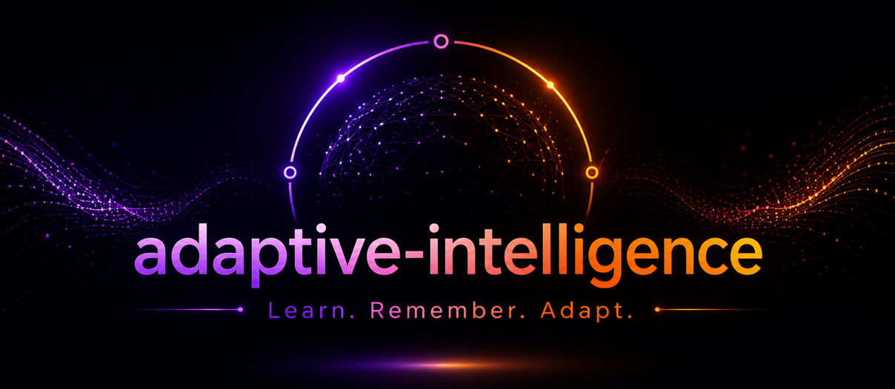

# adaptive-intelligence

Self-improving retrieval framework that learns, remembers, and connects tools.

## What it does

Instead of using the same retrieval strategy for every query, adaptive-intelligence uses reinforcement learning to select the best strategy per query type. The system evaluates every response, uses the score as a reward signal, and improves with every query answered.



## Install

```bash
pip install adaptive-intelligence                # Zero deps (Ollama, no-LLM mode)
pip install adaptive-intelligence[vector]         # + ChromaDB vector search
pip install adaptive-intelligence[openai]         # + Any OpenAI-compatible API (10+ providers)
pip install adaptive-intelligence[huggingface]    # + Local HuggingFace models
pip install adaptive-intelligence[all]            # Everything
```

## Quick start

```python
from adaptive_intelligence import AdaptiveAI

engine = AdaptiveAI()
engine.ingest("./documents")
response = engine.ask("What are the key risks?")
print(response.answer)
```

Works without any LLM — returns relevant document excerpts. Add an LLM for synthesized answers.

## LLM providers

The library works with any LLM. The `[openai]` extras installs the OpenAI SDK which connects to any OpenAI-compatible API.

### Free (no credit card needed)

```python
# Ollama — local, no extras needed
engine = AdaptiveAI()

# NVIDIA NIM — free cloud tier
engine = AdaptiveAI(
    api_key="nvapi-...",
    base_url="https://integrate.api.nvidia.com/v1",
    llm_model="meta/llama-3.1-70b-instruct"
)

# Groq — free cloud tier
engine = AdaptiveAI(
    api_key="gsk_...",
    base_url="https://api.groq.com/openai/v1",
    llm_model="llama-3.3-70b-versatile"
)

# Google Gemini — free tier
engine = AdaptiveAI(
    api_key="...",
    base_url="https://generativelanguage.googleapis.com/v1beta/openai/",
    llm_model="gemini-2.0-flash"
)

# Together AI — free tier
engine = AdaptiveAI(
    api_key="...",
    base_url="https://api.together.xyz/v1",
    llm_model="meta-llama/Llama-3-70b-chat-hf"
)

# Fireworks AI — free tier
engine = AdaptiveAI(
    api_key="...",
    base_url="https://api.fireworks.ai/inference/v1",
    llm_model="accounts/fireworks/models/llama-v3p1-70b-instruct"
)

# HuggingFace local — runs on your GPU, needs [huggingface] extras
engine = AdaptiveAI(
    llm_backend="huggingface",
    llm_model="Qwen/Qwen2.5-1.5B-Instruct"
)

# No LLM — retrieval only, zero dependencies
engine = AdaptiveAI(llm_backend="none")
```

### Paid

```python
# OpenAI
engine = AdaptiveAI(api_key="sk-...", llm_model="gpt-4o")

# Grok (xAI)
engine = AdaptiveAI(api_key="xai-...", base_url="https://api.x.ai/v1")

# Azure OpenAI
engine = AdaptiveAI(azure_endpoint="https://your.openai.azure.com/", api_key="...")
```

### Self-hosted

```python
# vLLM local server (free, runs on your GPU)
engine = AdaptiveAI(base_url="http://localhost:8000/v1")

# Any OpenAI-compatible server
engine = AdaptiveAI(base_url="http://your-server:8000/v1")
```

Any server that speaks the OpenAI-compatible API works with `[openai]` extras.

## Key features

### Context Engineering
Optimizes the entire context window — not just which chunks to retrieve, but what memory to include, how much history to keep, which tool results to add, and how to structure the prompt.

```python
engine = AdaptiveAI(context_engineering=True)
```

### MCP Integration
Connect external tools. Register MCP servers, REST APIs, or Python functions. The RL policy learns which tools to call per query type.

```python
# Register tools
engine.add_tool("financial", server="http://localhost:8081")
engine.add_tool("calculator", function=my_calc_function)
engine.add_tool("search", api_endpoint="https://api.example.com/search")

# List registered tools
engine.list_tools()

# Remove a tool
engine.remove_tool("search")

# Serve your retrieval as an MCP server
engine.serve_mcp(port=8080)
```

### Agentic Workflow
Multi-round retrieval. The system retrieves, evaluates confidence, refines the query, calls tools, and retrieves again until the answer is sufficient.

```python
response = engine.ask("Analyze supply chain risks and mitigation", mode="agentic")
```

### Persistent Memory
Remembers across sessions. Routing patterns, user preferences, and facts persist to disk.

```python
engine.remember("focus_area", "supply chain risk")
engine.recall("focus_area")
engine.search_memory("supply chain")
```

### Incremental Learning
Add new documents anytime. The RL policy, knowledge graph, and memory continue from their current state — no restart needed.

```python
engine.ingest("./initial_docs")           # Learn from initial set
engine.ingest("./quarterly_update.pdf")   # Add later, system continues
```

### RL-Based Retrieval Routing
Thompson Sampling or PPO learns which retrieval strategy works best per query type.

```python
engine = AdaptiveAI(rl_algorithm="ppo")
engine = AdaptiveAI(pretrained_policy=True, domain="financial")
engine.export_policy("learned.json")      # Transfer to another deployment
engine.import_policy("learned.json")
```

### Conditional Graph Activation
Knowledge graph auto-built during ingestion. A 5-signal gate activates graph traversal only when the query needs relational reasoning. Saves compute on 70% of queries.

### Vectorless Mode
No ChromaDB, no embeddings, zero dependencies. Uses page-level BM25 with page citations.

```python
engine = AdaptiveAI(vectorless=True)
```

### Structured Output

```python
response = engine.ask("Extract metrics", output_format="json")
response = engine.ask("List items", output_format="csv")
response = engine.ask("Summarize", output_format="yaml")
```

### User Feedback

```python
response = engine.ask("What are the risks?")
engine.feedback(response.query_id, "good")   # +0.2 RL reward
engine.feedback(response.query_id, "bad")    # -0.3 RL reward + prompt evolution
```

## Demos

### Colab notebook (no setup needed)
Run on free T4 GPU with no API key: `notebooks/adaptive_intelligence_v4_demo.ipynb`

### Local demos

```bash
cd demo_mcp_agenticai
pip install -r requirements.txt
python demo_basic.py      # Basic usage + incremental learning
python demo_tools.py      # Tool registry + cost optimization
python demo_agentic.py    # Agentic multi-round retrieval
python demo_mcp_server.py # Serve as MCP server (terminal 1)
python demo_mcp_client.py # Connect to MCP server (terminal 2)
```

## How it works

1. **Understand** — Trigger interpreter classifies query type, complexity, domain, entities (no LLM call)
2. **Decide** — RL policy selects retrieval route, depth, graph activation, tools to call
3. **Retrieve** — Executes via vector, BM25, or page index with RRF fusion. Graph activates conditionally.
4. **Generate** — Cross-encoder reranks chunks. Context engineer assembles full context window. LLM generates.
5. **Learn** — 6 metrics evaluate response. Composite score = RL reward. Policy updates. Next query is better.

## Links

- **PyPI:** https://pypi.org/project/adaptive-intelligence/
- **GitHub:** https://github.com/VK-Ant/adaptive-intelligence
- **Paper:** https://www.researchgate.net/publication/405076088
- **Portfolio:** https://vk-ant.github.io/Venkatkumar
- **Also:** [llmevalkit](https://pypi.org/project/llmevalkit/) — 61 metrics for LLM evaluation

## Author

Venkatkumar Rajan | [@VK_Venkatkumar](https://linkedin.com/in/venkatkumarvk)

## License

Apache License 2.0
